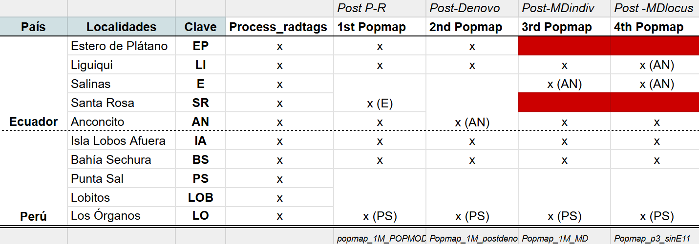
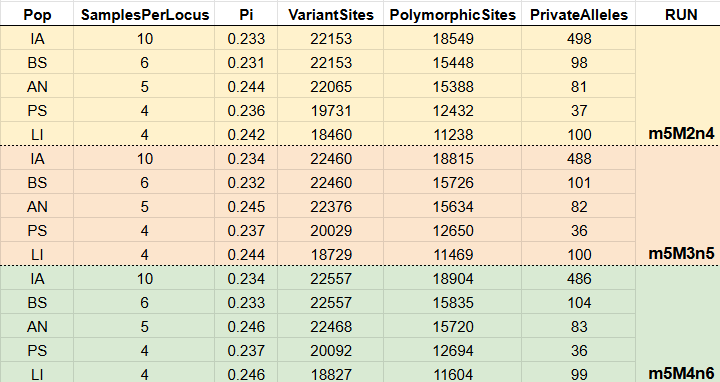
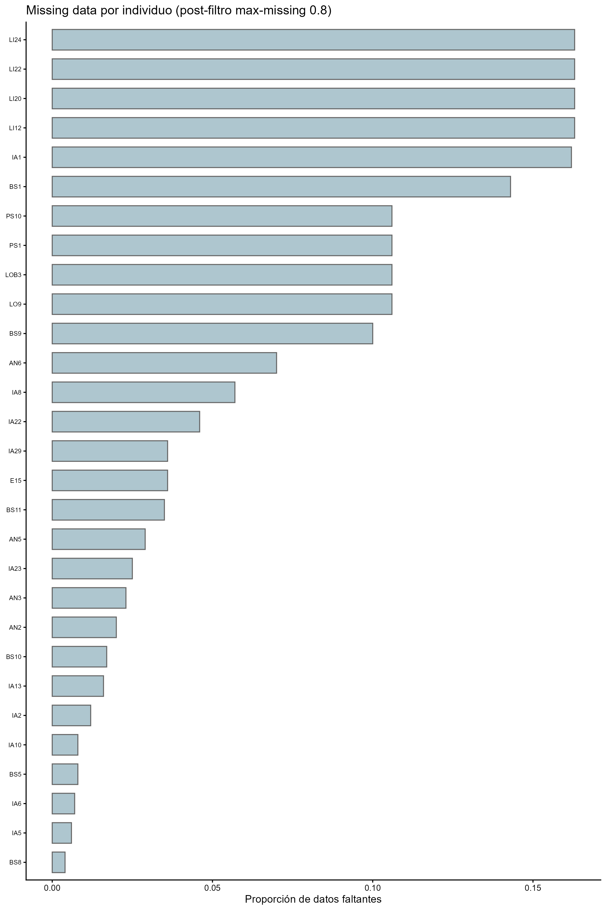
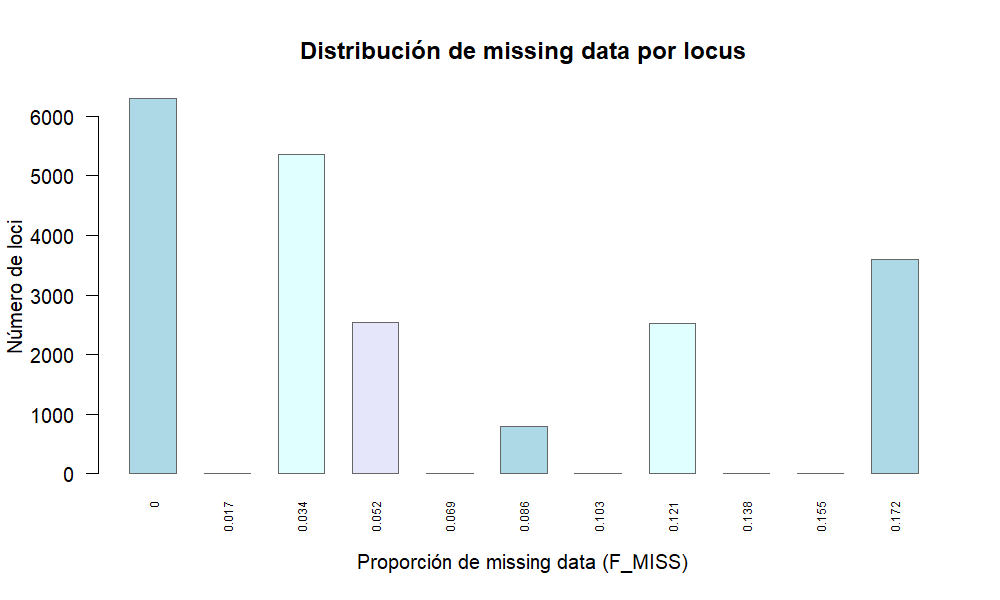

# Pipeline bioinformático con Stacks para *Octopus mimus*

1. **process_radtags**: demultiplexa y limpia las lecturas crudas
2. **denovo_map.pl**: ensambla de novo y genera compendios de loci
3. **populations**: estadísticas poblacionales y exportación de datos

---

## Server del CIBNOR

Conexión ssh, puerto 22

```bash
200.23.162.240
```

## Almacenamiento de las lecturas crudas

Datos `(/Datos/user/raw_pools)`

## Formatos de los archivos: barcodes & popmap

**BARCODEFILE:**
La estructura es `BARCODE` | `INDEX` | `SAMPLE_NAME`

**POPMAP**
`INDIVIDUO` | `CLAVE DE LOCALIDAD`
*Sin títulos de columnas

**Nombres de los archivos**

Los archivos crudos deben tener la extensión de `.fastq.gz` y **NO** `.fq.gz`.

Para cambiar los nombres de las extensiones:
```bash
cd /Datos/smunguia/raw_pools
```
```bash
for f in *.fq.gz; do mv "$f" "${f%.fq.gz}.fastq.gz"; done
```

## 1. process_radtags

Demultiplexa las lecturas por individuo y elimina lecturas de baja calidad.

Llamado del ambiente:
```bash
conda activate stacks
```

```bash
nohup process_radtags -P -p ./raw_pools -b ./barcodes/barcodes_Pool2y3.txt -o ./demultiplexed -c -q -r
-s 25 --inline_index --renz_1 ecoRI --renz_2 mspI &> process_log &
```

**Parámetros:**
- `-P`: datos paired-end (lecturas R1 + R2 emparejadas)
- `-p -/raw_pools`:  ruta hacia las lecturas crudas del pool
- `-b barcodes_Pool2y3.txt`: ruta hacia el archivo de barcodes
- `-o ./demultiplexed`: carpeta de salida para los archivos FastQ separados
- `-c`: clean: remueve lecturas con bases indeterminadas (N)
- `-q`: filtro de calidad (Phred)
- `-r`: rescata barcodes/sitios de corte con errores menores
- `-s 25`: umbral de Phred para el parámetro de -q
- `--inline_index`: índice dentro de la lectura, no como archivo aparte
- `--renz_1 ecoRI`: enzima corte raro (sitio GAATTC)
- `--renz_2 mspI`: enzima corte frecuente (CCGG)

**Notas**
- `nohup`: permite dejar el análisis en el background
- `process_log`: genera las notificaciones del análisis

Para checar los procesos actuales del servidor que están corriendo:

```bash
top
```

o

```bash
htop
```

Para observar resultados o la etapa del análisis se utiliza el comando:

```bash
more process_log
```

**Process_radtags output**

Se obtuvo >99M de lecturas por pool. El tiempo de computo fue de aproximadamente 1 hora x pool. 

Archivos demultiplexados del pool 3:


Una vez concluido el *process_radtags*, se obtuvieron los números siguientes:

| Categoría                     | Lecturas    | Porcentaje |
|-------------------------------|-------------|------------|
| Total de secuencias           | 398,933,454 | —          |
| Descartadas: barcode not found| 1,347,854   | 0.3%       |
| Descartadas: low quality read | 14,357,013  | 3.6%       |
| Descartadas: RAD cutsite not found | 2,322,453 | 0.6%    |
| Lecturas retenidas            | 380,906,134 | 95.5%      |

Lecturas Retenidas: Pool2 + Pool3


*Curva de distribución acumulada de los reads retenidos por individuo post-process_radtags.* ~33 de 96 individuos obtuvieron menos de 1 millón de lecturas retenidas. Aquellas con pocos reads, tienden aa presentar missing data alto. Esto permite considerar ya sea bajar el umbral de corte del número de lecturas (e. g. a 500K, 750K, 900K reads) para retener más individuos, evaluando el trade-off en profundidad con relación al tamaño de muestra.


Gráfico de barras: reads retenidos por individuo.

**Muestras descartadas por baja representación**

## Muestras excluidas por umbral (<900,000 reads retenidos)

| Barcode        | Muestra | Reads retenidos |
|----------------|---------|----------------:|
| CAACC-CGATGT   | EP13    |         589,759 |
| ACTGG-CGATGT   | EP25    |         208,992 |
| ACTTC-CGATGT   | EP26    |         351,010 |
| ATACG-CGATGT   | EP27    |         147,145 |
| ATGAG-CGATGT   | EP29    |         182,698 |
| ATTAC-CGATGT   | EP31    |         668,853 |
| CGTAC-CGATGT   | EP38    |         294,980 |
| CGTCG-CGATGT   | EP39    |         139,032 |
| CTGTC-CGATGT   | LI11    |          91,804 |
| GCCGT-CGATGT   | LI18    |         503,469 |
| GGCTC-CGATGT   | LI26    |         558,496 |
| GTAGT-CGATGT   | E4      |         413,270 |
| TACCG-CGATGT   | E13     |          38,346 |
| TCAGT-CGATGT   | SR8     |         864,141 |
| TCCGG-CGATGT   | SR10    |          46,839 |
| TCTGC-CGATGT   | SR11    |          68,910 |
| TGGAA-CGATGT   | SR13    |         140,476 |
| TTACC-CGATGT   | SR14    |         726,035 |
| ACTTC-TTAGGC   | IA17    |         557,048 |
| CATAT-TTAGGC   | IA28    |         145,897 |
| GGATA-TTAGGC   | BS6     |         103,150 |
| GTCGA-TTAGGC   | BS14    |         245,262 |
| TACCG-TTAGGC   | LOB1    |          21,999 |
| TACGT-TTAGGC   | LOB2    |         116,318 |
| TATAC-TTAGGC   | LO2     |          39,255 |
| TCACG-TTAGGC   | LO3     |          50,848 |
| TCAGT-TTAGGC   | LO4     |         490,205 |
| TCCGG-TTAGGC   | LO5     |          86,851 |
| TCTGC-TTAGGC   | LO6     |         721,876 |
| TTACC-TTAGGC   | LO10    |         365,500 |

**Total excluidas:** 30 muestras

Se excluyeron de análisis posteriores y se construyó el Popmap con los 66 individuos restantes (`popmap_1M_POPMODULE.txt`).

---

## 2. denovo_map.pl

Ensambla los loci de novo (sin genoma de referencia) y construye el 
catálogo compartido entre individuos.

Parámetros: `m=5`, `M=2,3,4` `n=M+2 (default)`

```bash
nohup denovo_map.pl --samples ./demultiplexed --popmap ./barcodes/popmap_1M_POPMODULE.txt -o ./stacks/R1M_m5M3n5 -m 5 -M 3 -n 5 -T 20 &> denovo_1M_m5M3n5_log &
```

```bash
nohup denovo_map.pl --samples ./demultiplexed --popmap ./barcodes/popmap_1M_POPMODULE.txt -o ./stacks/R1M_m5M4n6 -m 5 -M 4 -n 6 -T 20 &> denovo_1M_m5M4n6_log &
```

```bash
nohup denovo_map.pl --samples ./demultiplexed --popmap ./barcodes/popmap_1M_POPMODULE.txt -o ./stacks/R1M_m5M2n4 -m 5 -M 2 -n 4 -T 20 &> denovo_1M_m5M2n4_log &
```

**Parámetros clave:**
- `-m 5`: mínimo número de lecturas idénticas para formar un stack
- `-M 2`: número máximo de mismatches permitidos entre stacks de un mismo individuo
- `-n 4`: número máximo de mismatches permitidos entre individuos al construir el catálogo

**Notas**

- Optimización del ensamblaje de novo a partir de diferetntes combinaciones de parámetros: `RADstackshelpR` (DeRaad, 2021; https://github.com/DevonDeRaad/RADstackshelpR). 

- Los valores de **-m**, **-M** y **-n** son modificables respecto a los datos obtenidos. No hay valores universales:


---

## 3. populations

Genera estadísticas poblacionales, filtra loci y exporta formatos de salida (VCF, structure, etc.).

El número de poblaciones se modificón con relación al proceso de depuración de los individuos:



### 3.1 Populations inicial

- Localidades: 6
- `-p 4`
- Popmap: `Popmap_1M_m5M3n5_postdenovo.tsv`. Se utilizó el mismo archivo para los tres análisis ya que se eliminaron los mismos individuos.

**m5M2n4**

```bash
populations -P ./stacks/R1M_m5M2n4 --popmap ./barcodes/Popmap_1M_m5M3n5_postdenovo.tsv -O ./populations/1M_m5M2n4/ -p 4 -r 0.80 -t 5 --min-maf 0.05 --write-single-snp --genepop --vcf --fasta-loci --fasta-samples
```

**m5M3n5**

```bash
populations -P ./stacks/R1M_m5M3n5 --popmap ./barcodes/Popmap_1M_m5M3n5_postdenovo.tsv -O ./populations/1M_m5M3n5/ -p 4 -r 0.80 -t 5 --min-maf 0.05 --write-single-snp --genepop --vcf --fasta-loci --fasta-samples
```

**m5M4n6**

```bash
populations -P ./stacks/R1M_m5M4n6 --popmap ./barcodes/Popmap_1M_m5M3n5_postdenovo.tsv -O ./populations/1M_m5M4n6/ -p 4 -r 0.80 -t 5 --min-maf 0.05 --write-single-snp --genepop --vcf --fasta-loci --fasta-samples
```

**Parámetros:**
- `-r 0.8`: el locus debe estar presente en el 80% de los individuos por población (filtro r80)
- `-p 4`: número de poblaciones en las que un locus debe estar presente para conservarse en el análisis.
- `--min-maf 0.05`: filtro de frecuencia alélica menor mínima

  *MinMAF: Por SNP se calcula la frencuencia del alelo menos común en todo el conjunto muestreado, el valor de 0.05 nos dice que cualquier alelo menor tenga una frencuencia menor a 5% se descarta. Este umbral es estándar.*


### Filtrado de loci (post denovo, `-p 4`)

| Metric           | m5M2n4    | m5M3n5    | m5M4n6    |
|------------------|-----------|-----------|-----------|
| Loci removed     | 731596    | 711533    | 693727    |
| Total loci       | 771462    | 751492    | 733579    |
| Loci retained    | 39866     | 39959     | 39852     |
| Total sites      | 5825587   | 5839689   | 5824163   |
| Sites filtered   | 155436    | 158991    | 160145    |
| Variant sites    | 27961     | 28239     | 28296     |
  

*Se corrió un VCF por individuo y por locus. EP obtuvo más de >30% de missing data, esa localidad se eliminó.*


### 3.2 Populations intermedio

- Localidades: 5
- `-p 3`
- - Popmap: `Popmap_1M_m5M3n5_MD.tsv`. Se utilizó el mismo archivo para los tres análisis ya que se eliminaron los mismos individuos.

```bash
populations -P ./stacks/R1M_m5M2n4 --popmap ./barcodes/Popmap_1M_m5M3n5_MD.tsv -O ./populations/1M_m5M2n4/p3_postMissingData -p 3 -r 0.80 -t 5 --min-maf 0.05 --write-single-snp --genepop --vcf --fasta-loci --fasta-samples
```

```bash
populations -P ./stacks/R1M_m5M3n5 --popmap ./barcodes/Popmap_1M_m5M3n5_MD.tsv -O ./populations/1M_m5M3n5/p3_postMissingData -p 3 -r 0.80 -t 5 --min-maf 0.05 --write-single-snp --genepop --vcf --fasta-loci --fasta-samples
```

```bash
populations -P ./stacks/R1M_m5M2n4 --popmap ./barcodes/Popmap_1M_m5M3n5_MD.tsv -O ./populations/1M_m5M2n4/p3_postMissingData -p 3 -r 0.80 -t 5 --min-maf 0.05 --write-single-snp --genepop --vcf --fasta-loci --fasta-samples
```

**Loci sin localidad EP (n =30)**

| Metric         | m5M3n5 | m5M2n4 | m5M4n6 |
|----------------|--------|--------|--------|
| Loci retained  | 52154  | 52251  | 51948  |
| Variant sites  | 38776  | 38605  | 38776  |


### 3.3 Populations final

- Localidades: 5
- `-p 3`
- Individuos: 29
- Se eliminó EP y E11
- Popmap: `Popmap_p3_sinE11.tsv`. Se utilizó el mismo archivo para los tres análisis ya que se eliminaron los mismos individuos.
 
 ```bash
populations -P ./stacks/R1M_m5M3n5 --popmap ./barcodes/Popmap_p3_sinE11.tsv -O ./populations/1M_m5M3n5/p3_sinE11 -p 3 -r 0.80 -R 0.80 -t 5 --min-maf 0.05 --write-single-snp --genepop --vcf --fasta-loci --fasta-samples
```

```bash
populations -P ./stacks/R1M_m5M2n4 --popmap ./barcodes/Popmap_p3_sinE11.tsv -O ./populations/1M_m5M2n4/p3_sinE11 -p 3 -r 0.80 -R 0.80 -t 5 --min-maf 0.05 --write-single-snp --genepop --vcf --fasta-loci --fasta-samples
```

```bash
populations -P ./stacks/R1M_m5M4n6 --popmap ./barcodes/Popmap_p3_sinE11.tsv -O ./populations/1M_m5M4n6/p3_sinE11 -p 3 -r 0.80 -R 0.80 -t 5 --min-maf 0.05 --write-single-snp --genepop --vcf --fasta-loci --fasta-samples
```

- `-r 0.80`: dentro de cada población, al menos 80% de sus individuos deben tener el locus
- `-R 0.80`: a nivel genotipo/SNP, se exige 80% de cobertura por población (es equivalente al --max-missing de vcf).

### Número de loci por corrida para 29 individuos (- p 3)

| Metric         | m5M3n5  | m5M2n4  | m5M4n6  |
|----------------|---------|---------|---------|
| Total loci     | 751,492 | 771,462 | 733,579 |
| Loci retained  | 31,894  | 31,735  | 31,838  |
| Variant sites  | 22,460  | 22,153  | 22,557  |

### Estadísticas poblacionales finales





---

## Análisis del missing data (VCFtools)

*El análisis de missing data por individuo y por locus se fue generando entre los análisis del populations.*

**MD por individuo**

```bash
vcftools --vcf populations.snps.vcf --missing-indv --out miss_1M_m5M2n4_p3
```

**MD por locus**

```bash
vcftools --vcf populations.snps.vcf --missing-site --out missing_site_limpio
```

Para enlistar individuos o loci con mayor número de missing data:

```bash
sort -k5 -n -r missing_indv.imiss | head -20
```

```bash
sort -k6 -n -r missing_site_limpio.lmiss | head -20
```

Debido a que el missing data por locus fue alto para algunos individuos (*y que en análisis previos tales individuos no mostraron alto porcentaje de missing data*), se realizaron cortes de umbral para observar el porcentaje de loci retenidos.


| Umbral              | m5M3n5 (Loci retenidos) | m5M2n4 (Loci retenidos) | m5M4n6 (Loci retenidos) | m5M3n5 (% del total 38,776) | m5M2n4 (% del total 38,605) | m5M4n6 (% del total 38,776) |
|---------------------|--------------------------|--------------------------|--------------------------|-------------------------------|-------------------------------|-------------------------------|
| 0.5 (≤50% missing)  | 37,881                   | 37,709                   | 37,873                   | 98%                           | 98%                           | 98%                           |
| 0.7 (≤30% missing)  | 28,340                   | 28,060                   | 28,368                   | 73%                           | 73%                           | 73%                           |
| 0.8 (≤20% missing)  | 23,212                   | 22,959                   | 23,273                   | 60%                           | 59%                           | 60%                           |
| 0.9 (≤10% missing)  | 14,816                   | 14,610                   | 14,864                   | 38%                           | 38%                           | 38%                           |


Se seleccionó el umbral de 0.8, permitiendo el 20% de missing data. El número de SNPs final rondó entre los ~20K en todas las corridas.

Visualización directa de loci retenidos por cada umbral

```bash
for t in 0.5 0.7 0.8 0.9; do
  echo -n "max-missing $t: "
  awk -v t=$t 'NR>1 && (1-$6) >= t' missing_site_limpio.lmiss | wc -l
done
```

Al verificar el porcentaje de missing data por individuo y la distribución por por locus, efectivamente disminuyó para ambos análisis.


*Visualización completa de la distribución de los missing data*

```bash
awk 'NR>1 {print $6}' missing_site_limpio.lmiss | sort -n | uniq -c
```

### Missing data por individuo

| INDV  | m5M3n5 | m5M2n4 | m5M4n6 |
|-------|--------|--------|--------|
| LI24  | 16%    | 16%    | 16%    |
| LI22  | 16%    | 16%    | 16%    |
| LI20  | 16%    | 16%    | 16%    |
| LI12  | 16%    | 16%    | 16%    |
| IA1   | 16%    | 16%    | 16%    |
| BS1   | 14%    | 14%    | 14%    |
| PS1   | 11%    | 11%    | 11%    |
| PS10  | 11%    | 11%    | 11%    |
| LOB3  | 11%    | 11%    | 11%    |
| LO9   | 11%    | 11%    | 11%    |
| BS9   | 10%    | 10%    | 10%    |
| AN6   | 7%     | 7%     | 7%     |
| IA8   | 6%     | 6%     | 6%     |
| IA22  | 5%     | 5%     | 5%     |



### Númerode loci retenidos en distintos umbrales de missing data

| Missing data | m5M3n5 | m5M2n4 | m5M4n6 |
|--------------|--------|--------|--------|
| 0%           | 6301   | 6229   | 6342   |
| 3%           | 5360   | 5260   | 5365   |
| 7%           | 2534   | 2498   | 2531   |
| 10%          | 793    | 786    | 790    |
| 14%          | 2531   | 2514   | 2522   |
| 17%          | 3596   | 3583   | 3618   |





Al finalizar, se corrió un último *populations* con los 29 individuos restantes (- p 3) para obtener los estadísticos poblacionales finales (*ver 3.3 Populations final*).

---

## Resumen 


