# Pipeline bioinformático con Stacks para *Octopus mimus*

Este es un pipeline para el procesamiento de datos ddRADseq de *Octopus mimus*, desde las lecturas crudas hasta las estadísticas poblacionales, usando Stacks. 

## Resumen del pipeline

1. **process_radtags**: demultiplexa y limpia las lecturas crudas
2. **denovo_map.pl**: ensambla de novo y genera compendios de loci
3. **populations**: estadísticas poblacionales y exportación de datos

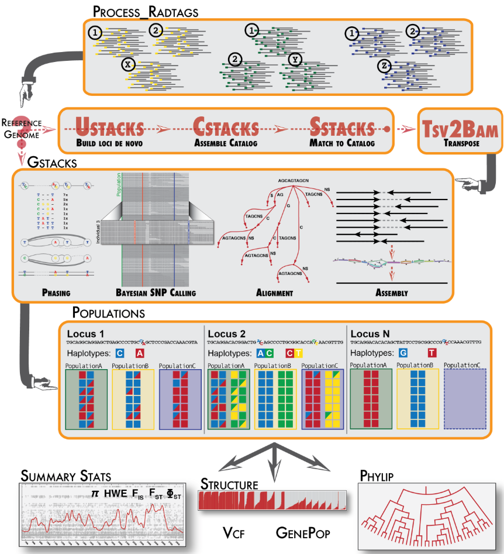
Stacks pipeline (Catchen et al., 2013)

---

## ¿Cómo acceder al servidor?

Server del CIBNOR
1. Abrir la aplicación de Hillstone secure connect para acceder con VPN.

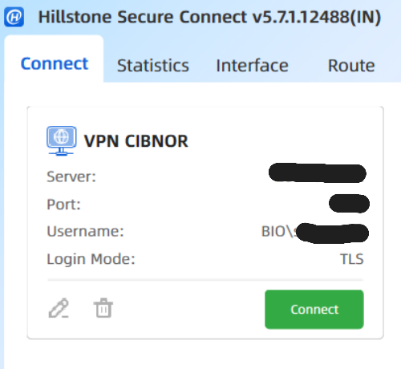

2. Conectarse al servidor a través de Putty en el puerto 22.

Tipo de conexión: ssh

```bash
200.23.162.240
```

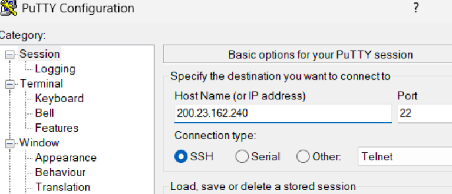

## Almacenamiento de las lecturas crudas

Dentro del servidor (CIBNOR) las lecturas crudas se deben almacenar en la carpeta de Datos, entonces tanto el raw_data (cada pool) y el barcodefile, así como el output con las lecturas demultiplexadas y limpias, se almacenan en Datos (/Datos/user/raw_pools).

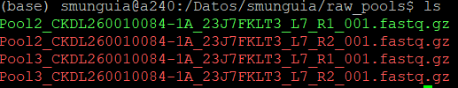

## Formatos de los archivos: barcodes & popmap

**BARCODEFILE:**
La estructura del barcodefile es **BARCODE** | **INDEX** | **SAMPLE_NAME**

Debe ser un archivo sin extensión o de texto o separado por tabulaciones.

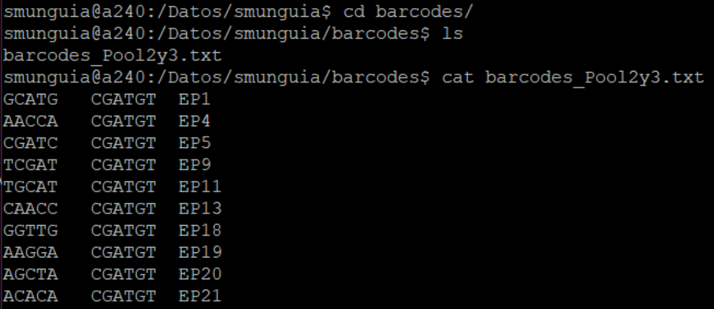

**Notas a considerar**

— Los barcodes e indexes que se utilizan durante la library prep provienen del manual de ddRADseq de Peterson *et al.* (2012). En el Laboratorio de Molecular y Genética del Cibnor estos NO se modificaron, se utilizan siempre los originales. 

En mi caso, para los pools 2 y 3 (individuos de Ecuador y Perú), utilicé los indexes 2 (CGATGT) y 3 (TTAGGC).

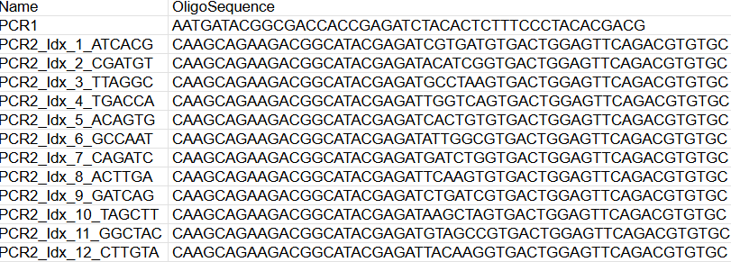

— Se tiene que checar que todas las carpetas que se ocupan como datos input deben estar localizadas en el mismo escalón o rama de árbol de directorios.

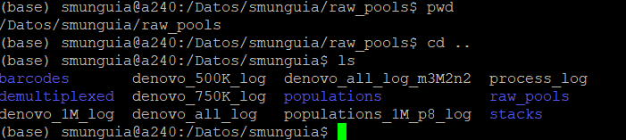

**Consideraciones: corrección de los nombres de los archivos**

Los nombres de los archivos puede ser que no sean los adecuados para que Stacks los ejecute. Los archivos crudos deben tener la extensión de **.fastq.gz** y NO .fq.gz (como se muestra en la siguiente imagen).


Ya que el parámetro de *rename* no está instalado en el servidor, se puede utilizar el loop *for* que no depende de paqueterías adicionales. Esto con la finalidad de renombrar extensiones de los archivos.
```bash
cd /Datos/smunguia/raw_pools
```
```bash
for f in *.fq.gz; do mv "$f" "${f%.fq.gz}.fastq.gz"; done
```

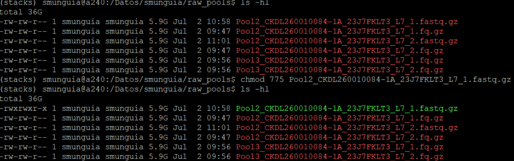


## 1. process_radtags

Demultiplexa las lecturas por individuo a partir de los archivos crudos 
del secuenciador Novogene y elimina lecturas de baja calidad.

Primeramente se llama al ambiente de stacks.

```bash
conda activate stacks
```

```bash
nohup process_radtags -P -p ./raw_pools -b ./barcodes/barcodes_Pool2y3.txt -o ./demultiplexed -c -q -r
-s 25 --inline_index --renz_1 ecoRI --renz_2 mspI &> process_log &
```

**Parámetros:**
- `-P`: datos paired-end (lecturas R1 + R2 emparejadas)
- `-p -/raw_pools`: la ruta hacia la carpeta donde están mis lecturas crudas del pool
- `-b barcodes_Pool2y3.txt`: ruta hacia la carpeta de archivo de barcodes
- `-o ./demultiplexed`: carpeta de salida para los archivos FastQ separados
- `-c`: clean: remueve aquellas lecturas con bases indeterminadas (N)
- `-q`: filtro  de calidad (Phred)
- `-r`: rescata barcodes/sitios de corte con errores menores
- `-s 25`: umbral de Phred para el parámetro de -q
- `--inline_index`: índice dentro de la lectura, no como archivo aparte
- `--renz_1 ecoRI`: enzima corte raro (sitio GAATTC)
- `--renz_2 mspI`: enzima corte frecuente (CCGG)

**Notas**
- `nohup`: permite dejar el análisis en el background. Si uno se va a tomar un café y cierra la PC, el server sigue computando el run.
- `process_log`: genera las notificaciones del análisis.

Para checar los procesos actuales del servidor que están corriendo:

```bash
top
```

o

```bash
htop
```

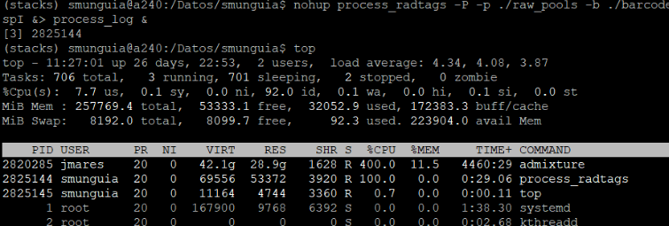

Para observar si *process_radtags* se congeló y no computó, o si simplemente se quiere saber el pasó en el que va o, en su caso, el desenlace de la corrida, entonces se utiliza el comando:

```bash
more process_log
```

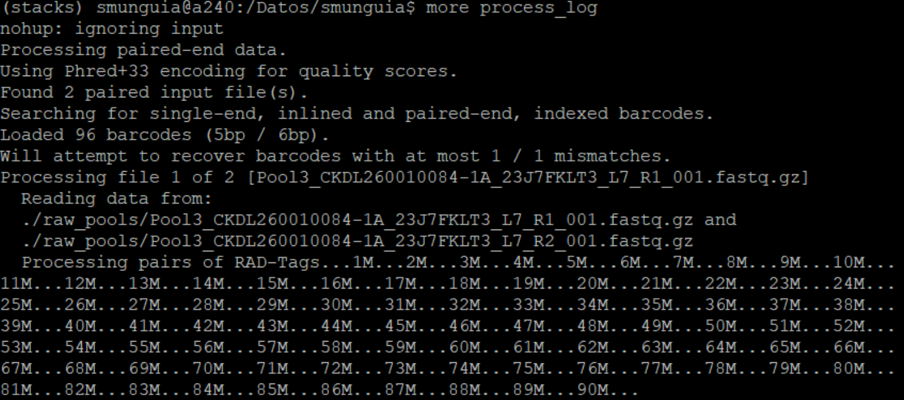


**Process_radtags output**

Al finalizar el run, se obtuvieron más de 99M de lecturas para cada pool. El tiempo de computo fue de aproximadamente 1 hora x pool. A continuación se muestran los archivos demultiplexados del pool 3:

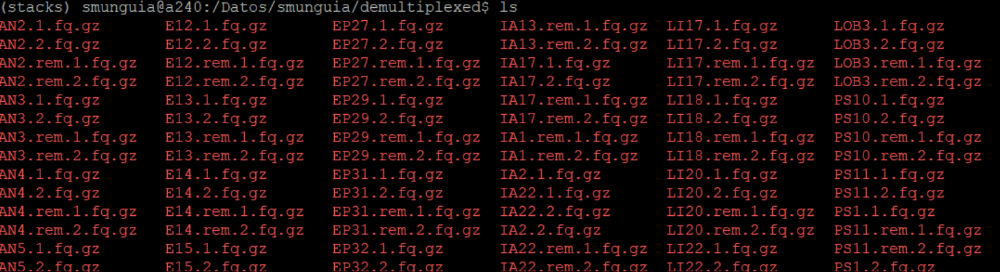

Una vez concluido el *process_radtags*, se obtuvieron los números siguientes:

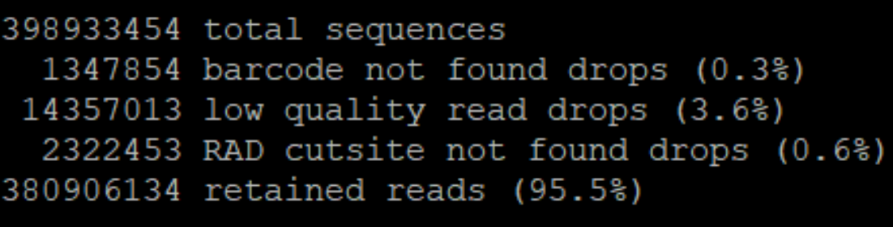

Lecturas Retenidas: Pool2 + Pool3

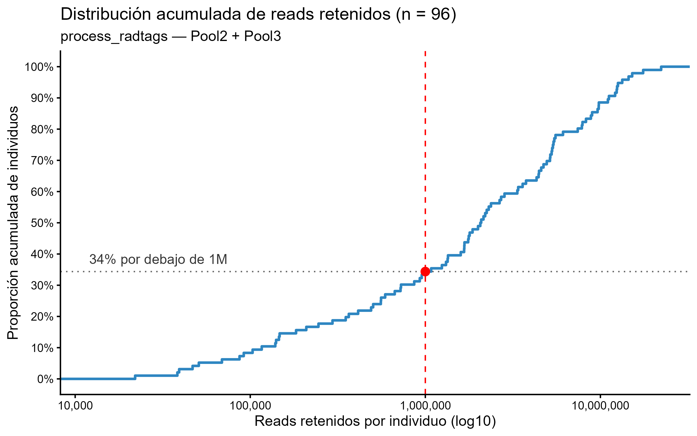

Esta gráfica es una curva de distribución acumulada de los reads retenidos por individuo post-process_radtags. Se observa que ~33 de 96 individuos obtuvieron menos de 1 millón de lecturas retenidas. Aquellas con pocos reads, tienden aa presentar missing data alto. Esto permite considerar ya sea bajar el umbral (e. g. a 500K, 750K, 900K reads) para retener más individuos, evaluando el trade-off en profundidad con relación al tamaño de muestra.

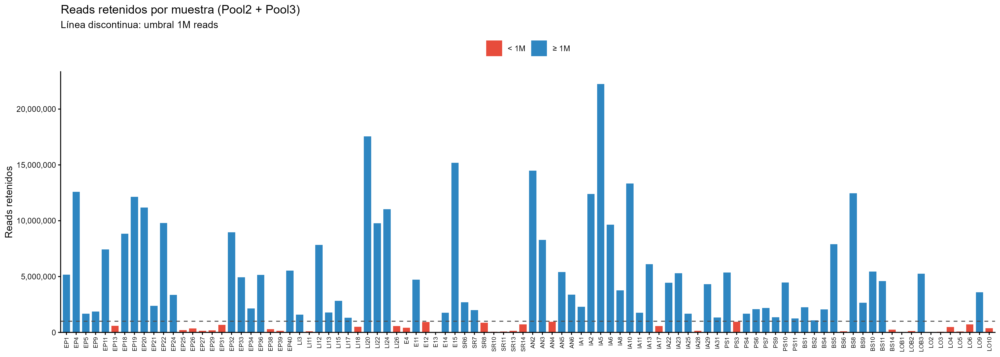
Gráfico de barras: reads retenidos por individuo.


---

## 2. denovo_map.pl

Ensambla los loci de novo (sin genoma de referencia) y construye el 
catálogo compartido entre individuos.


En un inicio se llevó a cabo tres análisis exploratorios de *denovo_map*. Con base en las lecturas por individuo obtenidas durante el demultiplexado (en la etapa de *process_radtags*), se realizaron tres cortes de filtrado de individuos, ya que el número de lecturas entre las 96 muestras fue heterogéneo. Los cortes fueron para 1) retener aquellos individuos que presentaron igual o mayor a un millón de lecturas (1M), 2) retener aquellos con igual o mayor a 750 millones de lecturas (750K) y 3) igual o mayor a 500 millones (500K).

**1M READS**
```bash
nohup denovo_map.pl --samples ./demultiplexed --popmap ./barcodes/popmap_1M.txt -o ./stacks/R1M -m 5 -M 2 -n 4 -T 10 &> denovo_1M_log &
```

**750K READS**
```bash
nohup denovo_map.pl --samples ./demultiplexed --popmap ./barcodes/popmap_750k.txt -o ./stacks/R750K -m 5 -M 2 -n 4 -T 20 &> denovo_750K_log &
```

**500K READS**
```bash
nohup denovo_map.pl --samples ./demultiplexed --popmap ./barcodes/popmap_500k.txt -o ./stacks/R500K -m 5 -M 2 -n 4 -T 20 &> denovo_500K_log &
```

**Parámetros clave:**
- `-m 5`: mínimo número de lecturas idénticas para formar un stack
- `-M 2`: número máximo de mismatches permitidos entre stacks de un mismo individuo
- `-n 4`: número máximo de mismatches permitidos entre individuos al construir el catálogo

**Notas**

En una primera instancia, los tres cortes se corrieron al mismo tiempo. Sin embargo, los runs de 1M y 750K abortaron el análisis por falta de memoria del server. 750K si generó la corrida completa. Para evitar que las tres cortes compitieran por recursos de memoria, se corrió una por una. Correr *denovo.map* tardó en mi caso aproximadamente >9 horas x corrida, esto depende en parte del número de muchos factores, como el número de reads por individuo, la parametrización que se utilice, el número de threads. Para los análisis de 750K y 1M, utilicé 20 threads porque ningún otro usuario del servidor estaba utilizándolo. Importante revisar antes de enviar cada run.

**Output**

EJEMPLO. Se generaron los archivos resultantes del run de 1M reads (/Datos/smunguia/stacks/R1M):

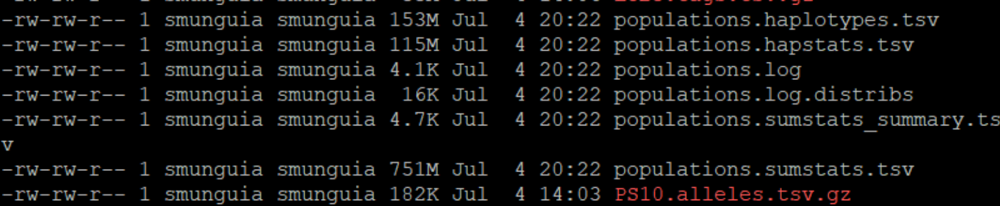

Revisé el archivo *population.log*, el cual compila diferentes estadísticas, como el número total de loci retenidos, el número de sitios variantes; y algunas estadísticas poblacionales por localidad (e.g. diversidad nucleotídica, sitios polimórficos, alelos privados, etc.).

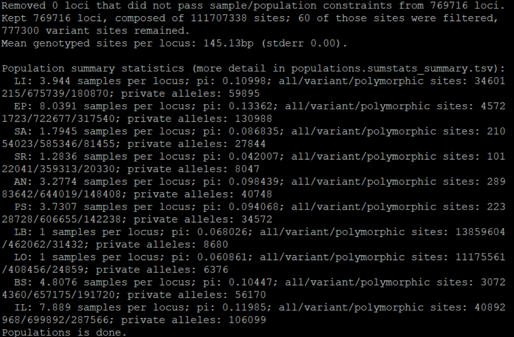

Asimismo, para las otras dos cortes de 500K y 750K reads, se generaron los archivos output correspondientes (no se muestran en este readme).

---

**Segunda aproximación: correr *denovo_map.pl* sin filtros de número de lecturas y en el módulo de *populations* ir depurando la base de datos**

Para esto, se generó un nuevo archivo Popmap incluyendo a todos los individuos; los valores de la parametrización no se modificaron (-m, -M, -n). Se ejecutó el siguiente comando:

```bash
nohup denovo_map.pl --samples ./demultiplexed --popmap ./barcodes/PopMap_sinFiltros.tsv -o ./stacks/RAllinOne -m 5 -M 2 -n 4 -T 10 &> denovo_all_log &
```

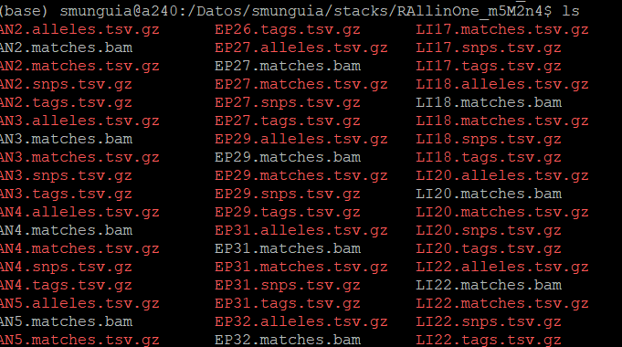

**Output de denovo_all_log**

Al finalizar la corrida, se generaron  archivos *populations.log* pero estos son sólo para revisar en una primera instancia los datos. No son las estadísticas finales. Esas se obtienen con el siguiente módulo de *populations*.

En este paso importa observar la tabla de estadísticas de loci por individuo. Permite conocer el número total de loci ensamblados, la cobertura (x), el número de lecturas y el porcentaje de retención por individuo.


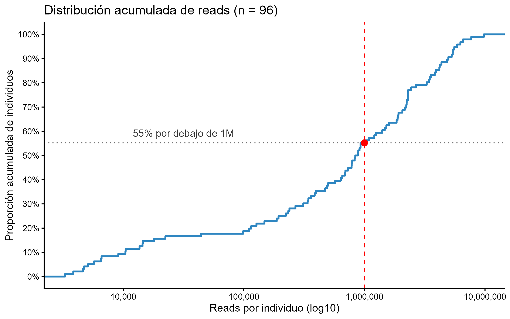


En mi caso, revisé valores esperados "estándar". Por ejemplo, un número alto de loci ensamblados (>10,000), una cobertura >10x, un número alto de lecturas (>1M), al menos un 80% de retención. Sin embargo, esto no fue el caso para ~21 individuos, ya que estos presentaron, en casos particulares <8 de % de retención, ~10K de reads, pocos loci ensamblados y baja cobertura. Se descartaron para generar un nuevo PopMap. En algunos casos, sí retuve ciertos individuos potenciales pese a que no todas sus estadísticas resultaron buenas. Por ejemplo, algunos individuos presentaron pocas reads (~500K), muy buena cobertura (>20x) y un número considerable de loci retenidos (~30K). 


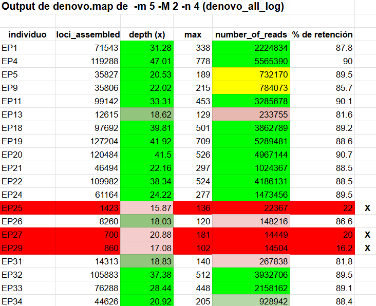


Al finalizar el conteo, mi nuevo PopMap se construyó con 75 individuos. Dado que la localidad **Lobitos (LOB)** originalmente solamente contaba con 3 individuos, con la depuración por número de reads y otras estadísitcas, se quedo en **n = 1**. Lo mismo con **Los Órganos (LO)**, pese a que contaba con más de 5 indivduos, la depuración redujo el número a **n = 1**. En el caso de **Santa Rosa (SR)**, una localidad problemática (casos límite de no-depuración), su n fue igual a **4**. Bajo este contexto, se decidió fusionar localidades/poblaciones con base en la distancia geográfica corta entre localidades muestreadas y el número de muestras totales por localidad. Por ende, LOB y LO se fusionó con Punta Sal (PS; n = 8) y SR con Salinas (E).

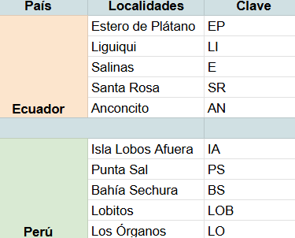

A continuación se muestra una tabla con el número total de muestras recuperadas: 


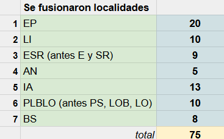


Un mapa geográfico de las localidades (Pliego-Cárdenas et al., 2021).


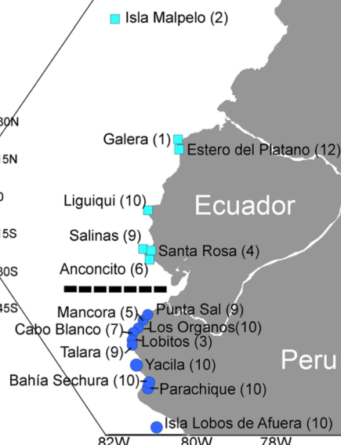


**Consideraciones**

Posteriormente, cuando obtenga las secuencias del total de pools para *O. mimus* y con el objetivo de optimizar el ensamblaje de novo, evaluaré sistemáticamente diferentes combinaciones de parámetro usando RADstackshelpR (DeRaad, 2021; https://github.com/DevonDeRaad/RADstackshelpR). Por ahora me quedo con la parametrización estándar.

Es importante mencionar que los valores de **-m**, **-M** y **-n**, son modificables respecto a los datos obtenidos de la secuenciacion y su procesamiento con el pipeline de stacks. Por eso es que para diferentes especies, estos números son distintos:

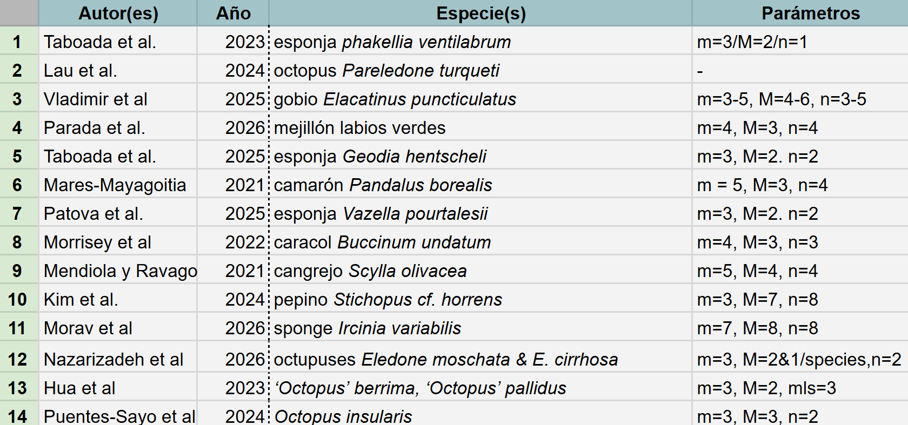


---

## 3. populations

Genera estadísticas poblacionales, filtra loci según parámetros de 
representación, y exporta formatos de salida (VCF, structure, etc.).

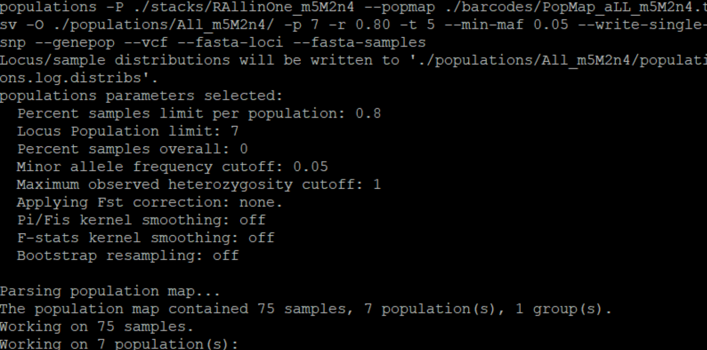

Generé dos runs con diferentes valores de -p. El primero fue una -p igual a 7. Este es un número muy exigente porque los loci deben estar presentes en las 7 poblaciones (EP, LI, ESR, AN, IA, PLBLO, BS). El primer comando utilizado fue:

```bash
populations -P ./stacks/RAllinOne_m5M2n4 --popmap ./barcodes/PopMap_aLL_m5M2n4.tsv -O ./populations/All_m5M2n4/ -p 7 -r 0.80 -t 5 --min-maf 0.05 --write-single-snp --genepop --vcf --fasta-loci --fasta-samples
```

**Parámetros:**
- `-r 0.8`: el locus debe estar presente en el 80% de los individuos por población (filtro r80)
- `-p 7`: número de poblaciones en las que un locus debe estar presente para conservarse en el análisis.
- `--min-maf 0.05`: filtro de frecuencia alélica menor mínima

  *Por SNP, se calcula la frencuencia del alelo menos común en todo el conjunto muestreado, el valor de 0.05 nos dice que cualquier alelo menor tenga una frencuencia menor a 5% se descarta. Este umbral es estándar.*

Como  primer output, se obtuvo un número bajo de SNPs por población:

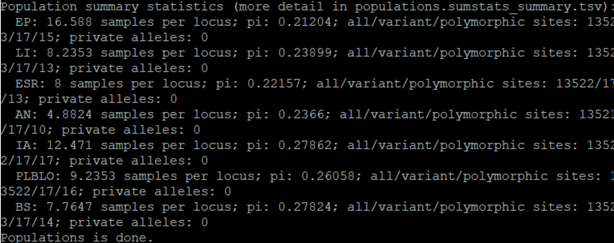

Reduje el número de -p a 5
  
```bash
populations -P ./stacks/RAllinOne_m5M2n4 --popmap ./barcodes/PopMap_aLL_m5M2n4.tsv -O ./populations/All_m5M2n4/ -p 5 -r 0.80 -t 5 --min-maf 0.05 --write-single-snp --genepop --vcf --fasta-loci --fasta-samples
```

De un número bajo de SNPs (-p 7) aumentó a más de 2000 SNPs (-p 5). Sin embargo, ESR (una de las localidades fusionada con organismos de Santa Rosa y Salinas) me generó únicamente 91 SNPs.


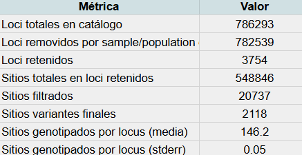

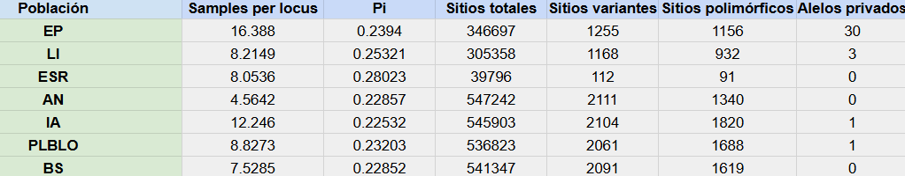


Se revisaron superficialmente los estadísticos de diversidad sin haber analizado los missing data por individuo y locus. El FIS fue alto para ESR (posiblemente debido a un error técnico y no a una realidad biológica). AN por el contrario, mostró casi un equilibrio completo de Hardy-Weinberg, quizás sea sesgo.

---

## Análisis del missing data

**Por indviduo: -p 5**

```bash
vcftools --vcf ./populations/All_m5M2n4_p5/populations.snps.vcf --missing-indv --out ./populations/All_m5M2n4_p5/missing_indv
```

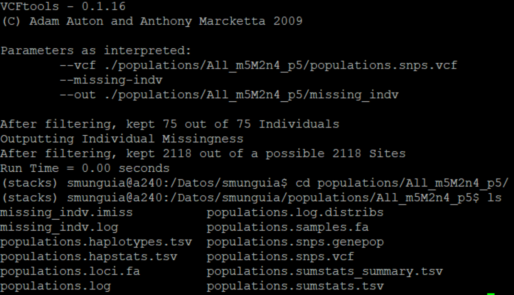

Para revisar aquellos individuos con más missing data:

```bash
sort -k5 -n -r missing_indv.imiss | head -20
```


**Output de missing data por individuo**

Con base en el % de missing data por individuo, se depuró más de la mitad de la base de datos, únicamente aceptando hasta un 30% de MD. En otros estudios, este número también se acepta.

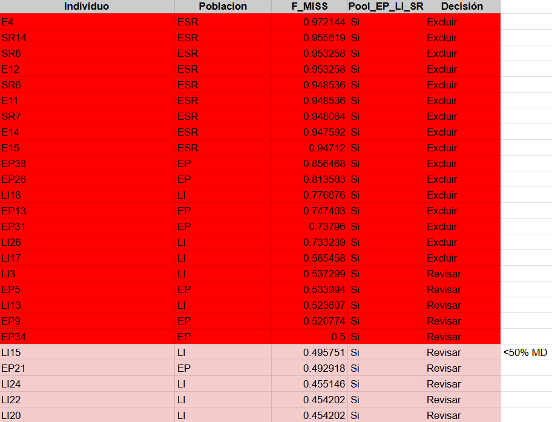

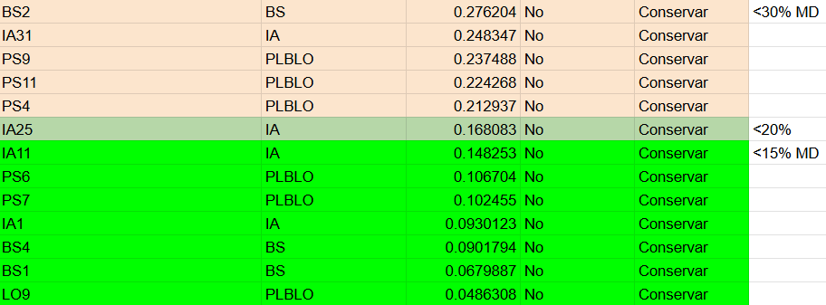

Analizando la tabla, EP, LI y SR mostraron el mayor número de MD. Estas tres localidades formaron parte de un mismo pool. En este sentido, prácticamente el pool completo obtuvo mucho MD, posiblemente por error técnico.

Posteriormente, generé un nuevo PopMap únicamente incluyendo aquellos individuos que presentaron <30% de MD. Corrí una vez más el módulo de populations. Al remover el pool problemático, aumentó el número de SNPs.

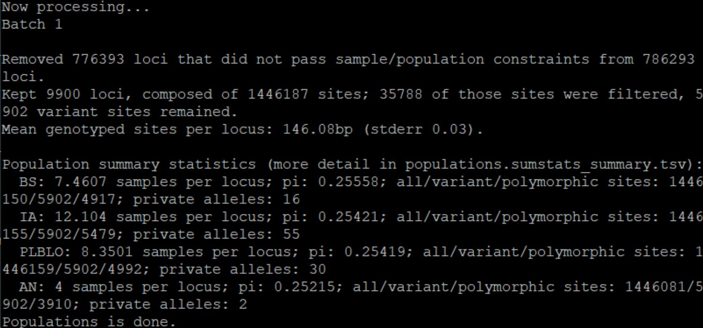

Corrí missing data por individuo:

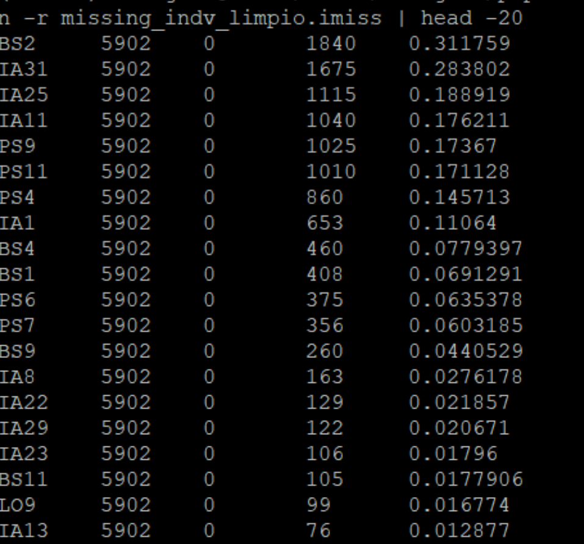

Corrí missing data por locus:

```bash
vcftools --vcf populations.snps.vcf --missing-site --out missing_site_limpio
```

```bash
sort -k6 -n -r missing_site_limpio.lmiss | head -20
```

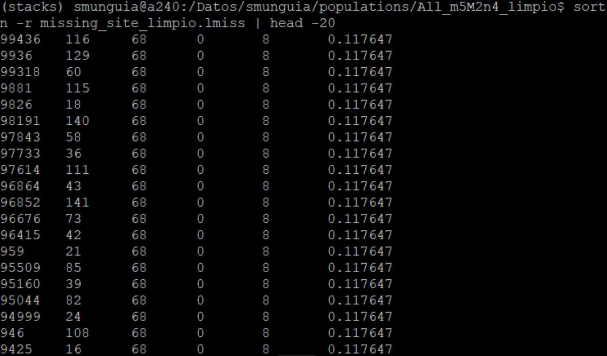


El nuevo dataset (n = 34, 4 poblaciones, correspondiente al pool 3) resultó estar más "limpio". BS2 fue el individuo que rebasó los 30% de MD. Sin embargo, lo consideré ya que está justo en el límite del umbral aplicado. El resto de individuos se mantuvieron por debajo de 30%. Respecto al MD x locus, está por debajo del 15%. Se considera aceptable.

---


