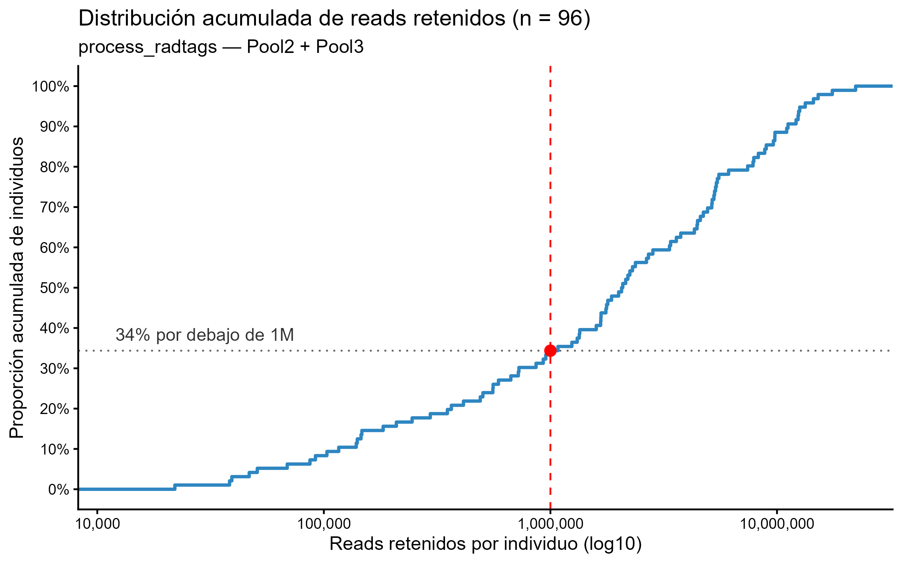
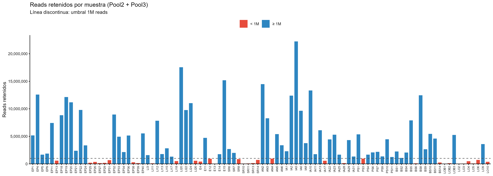
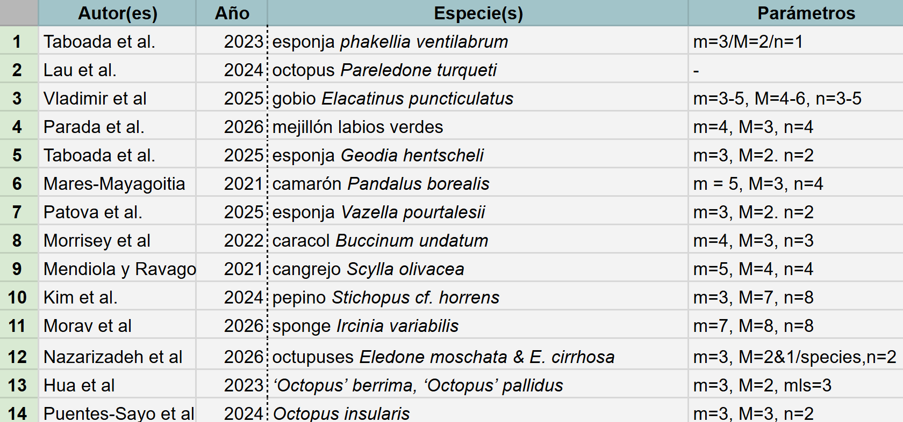
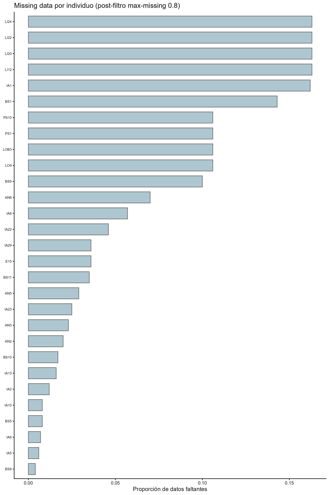
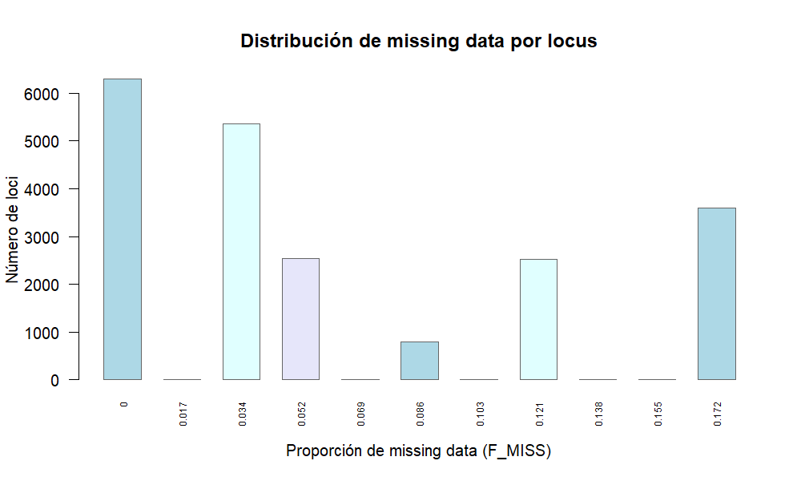

# Stacks *de novo*

1. **process_radtags**
2. **denovo_map.pl**
3. **populations**

---

```bash
200.23.162.240
```

## 1. process_radtags

```bash
nohup process_radtags -P -p ./raw_pools -b ./barcodes/barcodes_Pool2y3.txt -o ./demultiplexed -c -q -r
-s 25 --inline_index --renz_1 ecoRI --renz_2 mspI &> process_log &
```

**Process_radtags output**

Pool 2 y 3: >99M de lecturas/pool.

| Categoría                     | Lecturas    | Porcentaje |
|-------------------------------|-------------|------------|
| Total de secuencias           | 398,933,454 | —          |
| Descartadas: barcode not found| 1,347,854   | 0.3%       |
| Descartadas: low quality read | 14,357,013  | 3.6%       |
| Descartadas: RAD cutsite not found | 2,322,453 | 0.6%    |
| Lecturas retenidas            | 380,906,134 | 95.5%      |

Lecturas Retenidas: Pool2 + Pool3



*Curva de distribución acumulada de los reads retenidos por individuo post-process_radtags.* ~33 individuos obtuvieron menos de 1 millón de lecturas. 


Reads retenidos por individuo. 


## Muestras excluidas (<900,000 reads)

| Barcode        | Muestra | Reads retenidos |
|----------------|---------|----------------:|
| CAACC-CGATGT   | EP13    |         589,759 |
| ACTGG-CGATGT   | EP25    |         208,992 |
| ACTTC-CGATGT   | EP26    |         351,010 |
| ATACG-CGATGT   | EP27    |         147,145 |
| ATGAG-CGATGT   | EP29    |         182,698 |
| ATTAC-CGATGT   | EP31    |         668,853 |
| CGTAC-CGATGT   | EP38    |         294,980 |
| CGTCG-CGATGT   | EP39    |         139,032 |
| CTGTC-CGATGT   | LI11    |          91,804 |
| GCCGT-CGATGT   | LI18    |         503,469 |
| GGCTC-CGATGT   | LI26    |         558,496 |
| GTAGT-CGATGT   | E4      |         413,270 |
| TACCG-CGATGT   | E13     |          38,346 |
| TCAGT-CGATGT   | SR8     |         864,141 |
| TCCGG-CGATGT   | SR10    |          46,839 |
| TCTGC-CGATGT   | SR11    |          68,910 |
| TGGAA-CGATGT   | SR13    |         140,476 |
| TTACC-CGATGT   | SR14    |         726,035 |
| ACTTC-TTAGGC   | IA17    |         557,048 |
| CATAT-TTAGGC   | IA28    |         145,897 |
| GGATA-TTAGGC   | BS6     |         103,150 |
| GTCGA-TTAGGC   | BS14    |         245,262 |
| TACCG-TTAGGC   | LOB1    |          21,999 |
| TACGT-TTAGGC   | LOB2    |         116,318 |
| TATAC-TTAGGC   | LO2     |          39,255 |
| TCACG-TTAGGC   | LO3     |          50,848 |
| TCAGT-TTAGGC   | LO4     |         490,205 |
| TCCGG-TTAGGC   | LO5     |          86,851 |
| TCTGC-TTAGGC   | LO6     |         721,876 |
| TTACC-TTAGGC   | LO10    |         365,500 |

**Total excluidas:** 30 muestras

Se excluyeron de análisis posteriores y se construyó el Popmap con 64 individuos (`popmap_1M_POPMODULE.txt`, `7 localidades`). Los individuos `E12` y `PS3`, ambos con ~900K lecturas, se ignoraron del análisis (no existen en el catálogo R1M).

---

## 2. denovo_map.pl

- Catálogo: R1M (denovo_1M_log)
- Corte 1M reads
- m5M2n4


```bash
nohup denovo_map.pl --samples ./demultiplexed --popmap ./barcodes/popmap_1M.txt -o ./stacks/R1M -m 5 -M 2 -n 4 -T 10 &> denovo_1M_log &
```

**Parámetros**
- `-m 5`: mínimo número de lecturas idénticas para formar un stack
- `-M 2`: número máximo de mismatches permitidos entre stacks de un mismo individuo
- `-n 4`: número máximo de mismatches permitidos entre individuos al construir el catálogo


Los valores de **-m**, **-M** y **-n** son modificables. No hay valores universales:




---

## 3. populations

- 7 localidades en total (fusión SR-E y PS-LOB-LO).
- Para modulo de *populations*: popmap `popmap_1M_POPMODULE.txt`, `-p 5`


```bash
populations -P ./stacks/R1M --popmap ./barcodes/popmap_1M_POPMODULE.txt -O ./populations/1M/p5/ -p 5 -r 0.80 -t 5 --min-maf 0.05 --write-single-snp --genepop --vcf --fasta-loci --fasta-samples
```

**Parámetros:**
- `-r 0.8`: el locus debe estar presente en el 80% de los individuos por población (filtro r80)
- `-p 5`: número de poblaciones en las que un locus debe estar presente para conservarse en el análisis.
- `--min-maf 0.05`: filtro de frecuencia alélica menor mínima. Este umbral es estándar.
  
 **OUTPUT**:
 
- Loci retenidos: `12,757`
- Sitios variantes: `8,282`


---

## Análisis del missing data (VCFtools)


**MD por locus**

```bash
vcftools --vcf populations.snps.vcf --missing-site --out missing_site_first01
```

```bash
sort -k6 -n -r missing_site_first01.lmiss | head -20
```

**Resultado**: muchos loci con alto missing data >20%.

Para revisar el número de loci retenidos por cada umbral, se genera un loop:

```bash
for t in 0.5 0.6 0.7 0.8 0.9 0.95 1.0; do
  n=$(awk -v t=$t 'NR>1 && (1-$6) >= t' missing_site_first01.lmiss | wc -l)
  echo -e "${t}\t${n}"
done
```

**Resultados**: a un umbral de 0.5, se retienen 8,260 loci, a 0.7 = 4,706 loci retenidos. Se seleccionó el umbral de `0.8` reteniendo `1,782`, permitiendo el 20% de missing data

```bash
vcftools --vcf populations.snps.vcf --max-missing 0.8 --recode --recode-INFO-all --out vcf_filtrado_locus_08
```

**MD por individuo**

Se aplicó VCF sobre el archivo ya filtrado `vcf_filtrado_locus_08.recode.vcf`

```bash
vcftools --vcf vcf_filtrado_locus_08.recode.vcf --missing-indv --out missing_indv_post_locus_08
```


*Visualización completa de la distribución de los missing data*

```bash
awk 'NR>1 {print $6}' missing_site_limpio.lmiss | sort -n | uniq -c
```

### Missing data por individuo

| INDV  | m5M3n5 | m5M2n4 | m5M4n6 |
|-------|--------|--------|--------|
| LI24  | 16%    | 16%    | 16%    |
| LI22  | 16%    | 16%    | 16%    |
| LI20  | 16%    | 16%    | 16%    |
| LI12  | 16%    | 16%    | 16%    |
| IA1   | 16%    | 16%    | 16%    |
| BS1   | 14%    | 14%    | 14%    |
| PS1   | 11%    | 11%    | 11%    |
| PS10  | 11%    | 11%    | 11%    |
| LOB3  | 11%    | 11%    | 11%    |
| LO9   | 11%    | 11%    | 11%    |
| BS9   | 10%    | 10%    | 10%    |
| AN6   | 7%     | 7%     | 7%     |
| IA8   | 6%     | 6%     | 6%     |
| IA22  | 5%     | 5%     | 5%     |



### Númerode loci retenidos en distintos umbrales de missing data

| Missing data | m5M3n5 | m5M2n4 | m5M4n6 |
|--------------|--------|--------|--------|
| 0%           | 6301   | 6229   | 6342   |
| 3%           | 5360   | 5260   | 5365   |
| 7%           | 2534   | 2498   | 2531   |
| 10%          | 793    | 786    | 790    |
| 14%          | 2531   | 2514   | 2522   |
| 17%          | 3596   | 3583   | 3618   |





Al finalizar, se corrió un último *populations* con los 29 individuos restantes (- p 3) para obtener los estadísticos poblacionales finales (*ver 3.3 Populations final*).

---

## R1M (denovo_1M_log)

- Corte 1M reads
- 7 localidades en total (fusión SR-E y PS-LOB-LO). Se excluyeron dos individuos que en las corridas pasadas estuvieron presentes: `E12` y `PS3`, ambos con ~900K lecturas.
- Para modulo de *populations*: popmap `popmap_1M_POPMODULE.txt`, `-p 5`
- m5M2n4

Comandos iniciales (denovo y populations):

```bash
nohup denovo_map.pl --samples ./demultiplexed --popmap ./barcodes/popmap_1M.txt -o ./stacks/R1M -m 5 -M 2 -n 4 -T 10 &> denovo_1M_log &
```

```bash
populations -P ./stacks/R1M --popmap ./barcodes/popmap_1M_POPMODULE.txt -O ./populations/1M/p5/ -p 5 -r 0.80 -t 5 --min-maf 0.05 --write-single-snp --genepop --vcf --fasta-loci --fasta-samples
```

- Loci retenidos: `12,757`
- Sitios variantes: `8,282`

Al correr el análisis de VCF x individuo **22 individuos** se excluyeron (toda la localidad de LI, EP5, EP9, E14,EP34, SR4, AN4, EP21, SR6, PS9, PS11, BS2, EP24, PS4, E11).

Se generó un nuevo popmap con 42 individuos `popmap_m5M2n4_p3_1M_R1M.tsv` excluyendo los 22 individuos para volver a correr *populations* `-p 3` y recalcular missingness x individuo x locus. 

```bash
populations -P ./stacks/R1M --popmap ./barcodes/popmap_m5M2n4_p3_1M_R1M.tsv -O ./populations/1M/p3/ -p 3 -r 0.80 -t 5 --min-maf 0.05 --write-single-snp --genepop --vcf --fasta-loci --fasta-samples
```

Se obtuvo alto missing data x locus x individuos. `-r 0.80` es una proporción relativa al N de cada población, por eso el missing data cambia. Apliqué un filtro de `--max-missing 0.8`

```bash
vcftools --vcf populations.snps.vcf --max-missing 0.8 --recode --recode-INFO-all --out mimus_filtered_m08
```

Al checar el missingnes x locus con `sort`, el valor máximo de MD fue de 19%. 

La cuestión es que decenas de loci presentaron entre 16% y 19% de MD. Para checar si ese missingness se concentra en un grupo de individuos en particular: 

```bash
awk 'NR>1 {print $6}' check_final_site.lmiss | sort -n | uniq -c | sort -rn | head -20
```

- `uniq -c`: números de grupos discretos de MD
- Por qué los valores se repite: N bajo (N=42)
- Distribución de loci (número de loci que comparten cada valor de F_miss): aunque la distribución del MD se mantuvo por debaji del 20%, 543 loci obtuvieron ~19% MD.

Se extrajo el ID de esos 543 loci para revisar si son un conjunto de individuos específicos que podrían ocasionar sesgo y revisar si necesitan ser excluidos

```bash
awk 'NR>1 && $6==0.190476 {print $1}' check_final_site.lmiss > loci_nmiss8.txt
```

El siguiente comando muestra el nombre del individuo junto a su genotipo para ese locuos específico: 

```bash
paste <(grep "^#CHROM" mimus_filtered_m08.recode.vcf | tr '\t' '\n') \
      <(grep -P "^99847\t" mimus_filtered_m08.recode.vcf | tr '\t' '\n') \
      | tail -n +10
```

-`#CHROM`: es la columna de los IDs de cada locus representados en números (e.g. locus 99847).

Se observó que todo el grupo de PS, incluyendo los individuos fusionados LO9 y LOB3 falla en el locus 99847. Se genotipa bien para las otras poblaciones. 

PAra observar si en la mayoría de los loci hay ausencia de individuos de PS, entonces:

```bash
for locus in $(head -10 loci_nmiss8.txt); do
  echo "=== Locus $locus ==="
  paste <(grep "^#CHROM" mimus_filtered_m08.recode.vcf | tr '\t' '\n') \
        <(grep -P "^${locus}\t" mimus_filtered_m08.recode.vcf | tr '\t' '\n') \
        | tail -n +10 | awk '$2 ~ /^\.\/\./ {print $1}'
done
```

Se observó que el grupo de PS está ausente en la mayoría de los loci observados. Hay missingness a nivel población completa. Con base en esto, hice una curva de diferentes -p con un loop:

```bash
for p in 3 4 5; do
  populations -P ./stacks/R1M --popmap ./barcodes/popmap_m5M2n4_p3_1M_R1M.tsv \
    -O ./populations/1M/test_p${p}/ -p $p -r 0.80 -t 5 --min-maf 0.05 --vcf 2>&1 | grep "Kept"
done
```

| -p | Loci retenidos | Sitios variantes |
|:--:|---------------:|-----------------:|
| 3  | 45,894         | 78,365           |
| 4  | 34,025         | 54,417           |
| 5  | 20,137         | 29,435           |


Subí la -p y volví a correr *populatios* `-p 5`. Es más estrictor pero reduce el sesgo poblacional.

```bash
populations -P ./stacks/R1M --popmap ./barcodes/popmap_m5M2n4_p3_1M_R1M.tsv \ -O ./populations/1M/p5_final/ -p 5 -r 0.80 -t 5 --min-maf 0.05 \ --write-single-snp --genepop --vcf --fasta-loci --fasta-samples
```

```bash
vcftools --vcf populations.snps.vcf --missing-site --out missing_site_p5
```

```bash
vcftools --vcf populations.snps.vcf --missing-indv --out missing_indv_p5
```

El individuo IA31 mostró 0.3165 (30%), se descartó. En general, el missing data x locus x individuo se redujo.

```bash
populations -P ./stacks/R1M --popmap ./barcodes/popmap_final_no_IA31.tsv \ -O ./populations/1M/p5_definitivo/ -p 5 -r 0.80 -t 5 --min-maf 0.05 \ --write-single-snp --genepop --vcf --fasta-loci --fasta-samples
```

| Métrica          | Valor                 |
|:-----------------|:----------------------|
| Loci retenidos   | 21,971 (de 769,716)   |
| Sitios variantes | 14,965                |
| Sitios totales   | 3,209,909             |

| Población | Muestras/locus | π       | Alelos privados |
|:----------|---------------:|--------:|----------------:|
| EP        | 10.021         | 0.24688 | 191             |
| IA        | 11.185         | 0.22610 | 49              |
| AN        | 4.8466         | 0.24114 | 4               |
| PS        | 5.5938         | 0.23263 | 8               |
| BS        | 6.584          | 0.22465 | 12              |

Post-prueba de MD con VCF los individuos mostraron <25% MD


